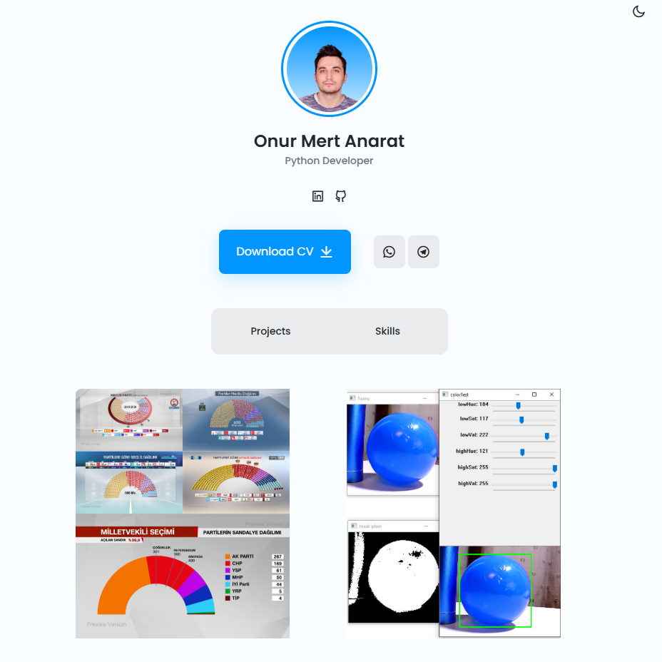
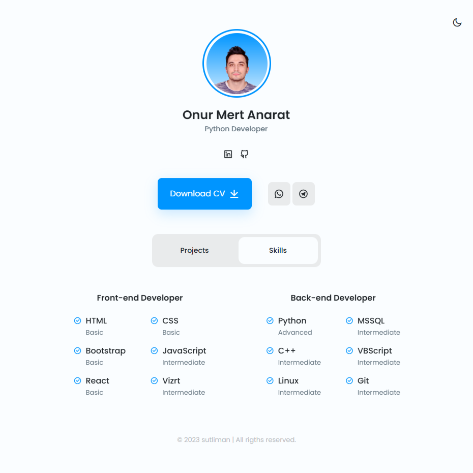

# Personal Portfolio Website

This repository contains the source code for my personal portfolio website. It is a single-page application designed to provide a professional overview of my skills and projects.

The project was developed from scratch using core web technologies to ensure high performance and maintainability.

---

## Screenshots

<table>
  <tr>
    <td></td>
    <td></td>
  </tr>
</table>

---

## Features

* **Responsive Layout:** The application is fully responsive and functions correctly on various screen sizes, including mobile, tablet, and desktop devices.
* **Dual Theme Support:** Includes both light and dark themes for user preference.
* **Theme Persistence:** The user's theme selection is saved in the browser's `localStorage` and is automatically applied on subsequent visits.
* **Interactive UI:** Features a tab-based interface for easy navigation between content sections.
* **Scroll Animations:** Subtle animations are implemented to improve the user experience during scrolling.

---

## Technology Stack

The project is built exclusively with front-end technologies:

* HTML5
* CSS3 (utilizing Variables, Flexbox, and Grid)
* Vanilla JavaScript (ES6+)
* ScrollReveal.js (for scroll animations)
* Remix Icon (for iconography)

---

## Local Setup

To run this project on your local machine, follow these steps:

1.  Clone the repository to your local system.
    ```sh
    git clone [https://github.com/onurmertanarat/portfolio.git](https://github.com/onurmertanarat/portfolio.git)
    ```

2.  Navigate into the project directory.
    ```sh
    cd portfolio
    ```

3.  Open the `index.html` file in your preferred web browser.

---

## Contact

Onur Mert Anarat

[linkedin.com/in/onurmertanarat](https://www.linkedin.com/in/onurmertanarat)
